# 研究件名

ゲームのレビューから見る顧客の離脱要因とその改善方法

# 背景・リサーチクエスチョンと仮説

近年のゲーム市場におけるPCゲームの台頭は凄まじく、プラットフォーム「Steam」を中心として幅広い層に普及している。そんな中の運営において、新規顧客の獲得コストは往々にして維持コストよりも増大する傾向にあるため、プレイヤーの離脱要因を特定し維持率を向上させることは大きな課題だと思う。

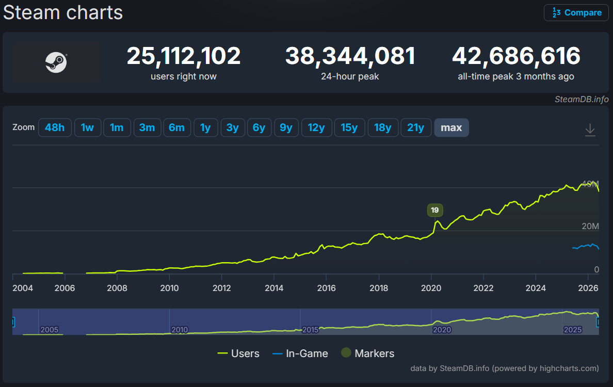

今回はSteamのユーザーレビューの特性を利用し、テキストマイニングを行うことでそのゲームの本質を分析し、同時にそのジャンルの特徴や課題（離脱要因）を明らかにするのが目的である。さらに、今回のデータに含まれているプレイ時間（ユーザーフェーズ）などと結び付けて分析することでユーザーの熟練度に応じた動的な課題も明らかにできる。

RQ：離脱時期、レビューの賛否に応じてレビュートピックに統計的に有意な差は現れるか

仮説：初期の高評価と長期の低評価にはレビュー内容に相関があるのではないか

# 使用データ詳細

## 概要・変数一覧

データは\[SteamPowered.com\]というレビュー内容取得APIを使って入手する

このAPIを使って特定のゲームのレビューをまとめて収集することが可能になる。

そしてSteamは多言語プラットフォームだが、languageのオプションを付けることで日本語のみのレビューを絞り込める！今回は複雑化を避けるため、日本語レビューのみに絞って検証していく

そこから入手できるデータの変数23個に加え、それを加工して作った新たな変数3個を加えた計26個の変数を今回は使っていく。重要な変数は太字で上に優先的に表記してある。

+--------------------------------------+----------------------------------------------------------------------+
| 変数名                               | 内容                                                                 |
+======================================+======================================================================+
| **game_name**                        | ゲームの名前                                                         |
+--------------------------------------+----------------------------------------------------------------------+
| **genre (tah)**                      | ゲームのジャンル                                                     |
+--------------------------------------+----------------------------------------------------------------------+
| **date_created (timestamp_created)** | レビューが投稿された日                                               |
+--------------------------------------+----------------------------------------------------------------------+
| **review_text**                      | レビュー本文                                                         |
+--------------------------------------+----------------------------------------------------------------------+
| **date_updated (timestamp_updated)** | レビューが更新された日                                               |
+--------------------------------------+----------------------------------------------------------------------+
| **comment_count**                    | このレビューに対するコメント数                                       |
+--------------------------------------+----------------------------------------------------------------------+
| **playtime_at_review**               | レビュー投稿時でのプレイ時間                                         |
+--------------------------------------+----------------------------------------------------------------------+
| **playtime_forever**                 | 通算プレイ時間                                                       |
+--------------------------------------+----------------------------------------------------------------------+
| **playtime_last_two_weeks**          | 直近2週間でのプレイ時間                                              |
+--------------------------------------+----------------------------------------------------------------------+
| **date_last_day (last_played)**      | 最終プレイ時間                                                       |
+--------------------------------------+----------------------------------------------------------------------+
| recommendationid                     | レビュー固有のID                                                     |
+--------------------------------------+----------------------------------------------------------------------+
| voted_up                             | 肯定的なおすすめと判断されたレビュー　（ピックアップされたレビュー） |
+--------------------------------------+----------------------------------------------------------------------+
| votes_up                             | \[参考になった\]と評価したユーザー数                                 |
+--------------------------------------+----------------------------------------------------------------------+
| votes_funny                          | \[面白い\]と評価したユーザー数                                       |
+--------------------------------------+----------------------------------------------------------------------+
| weighted_vote_score                  | \[参考になった\]スコア（％）                                         |
+--------------------------------------+----------------------------------------------------------------------+
| num_reviews                          | ユーザーが投稿したレビュー数                                         |
+--------------------------------------+----------------------------------------------------------------------+
| num_game_owned                       | ユーザーが持っているゲーム数                                         |
+--------------------------------------+----------------------------------------------------------------------+
| steam_purchase                       | Steamで購入したかどうか                                              |
+--------------------------------------+----------------------------------------------------------------------+
| recieved_for_free                    | 無料で受け取ったかどうか                                             |
+--------------------------------------+----------------------------------------------------------------------+
| developer_response                   | 開発者からの返信（無い場合はNA）                                     |
+--------------------------------------+----------------------------------------------------------------------+
| timestamp_dev_responded              | 開発者からの返信投稿時刻                                             |
+--------------------------------------+----------------------------------------------------------------------+
| total_reviews_in_data                | このゲームの総レビュー数                                             |
+--------------------------------------+----------------------------------------------------------------------+

今回の分析では、Steamの中でも特に有名な以下の７ジャンルに絞って各10ゲーム分の分析を行おうと思う。

- Indie

- Action

- Casual

- Adventure

- Simulation

- Strategy

- RPG

## ジャンル別データ概要

今回の分析では、"https://gamelog-jp.com/ranking/"という日本で遊ばれているゲームがランキング形式で分かるサイトを参考にしてゲームを選定している。そこから7ジャンル各10ゲーム分のデータを集めたところ、計**48377**件のレビューデータを集めることが出来た。 ここからはジャンル別に今回の分析で使ったランキングを示し、そのデータの特徴も表記していく。

### Action

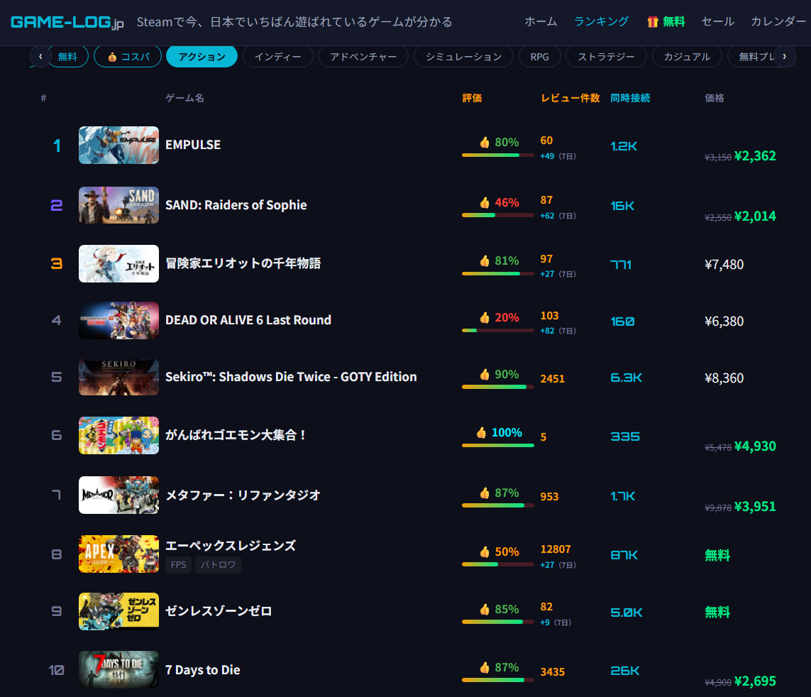

レビューデータは計8476件、二番目に多いジャンルである。Actionというジャンルがかなり広義なため、様々なゲームがここに含まれる。

### Indie

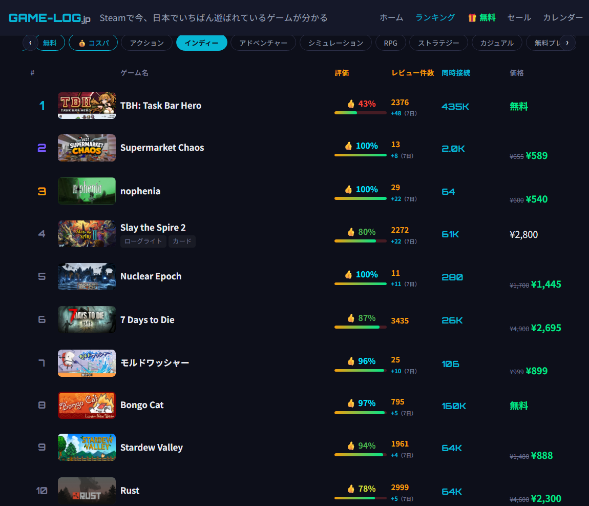

レビューデータは計7956、4番目に多いジャンルである。このジャンルではお手頃な価格のゲームが数多くあるため、多くの人に遊ばれる傾向にある。

### Adventure

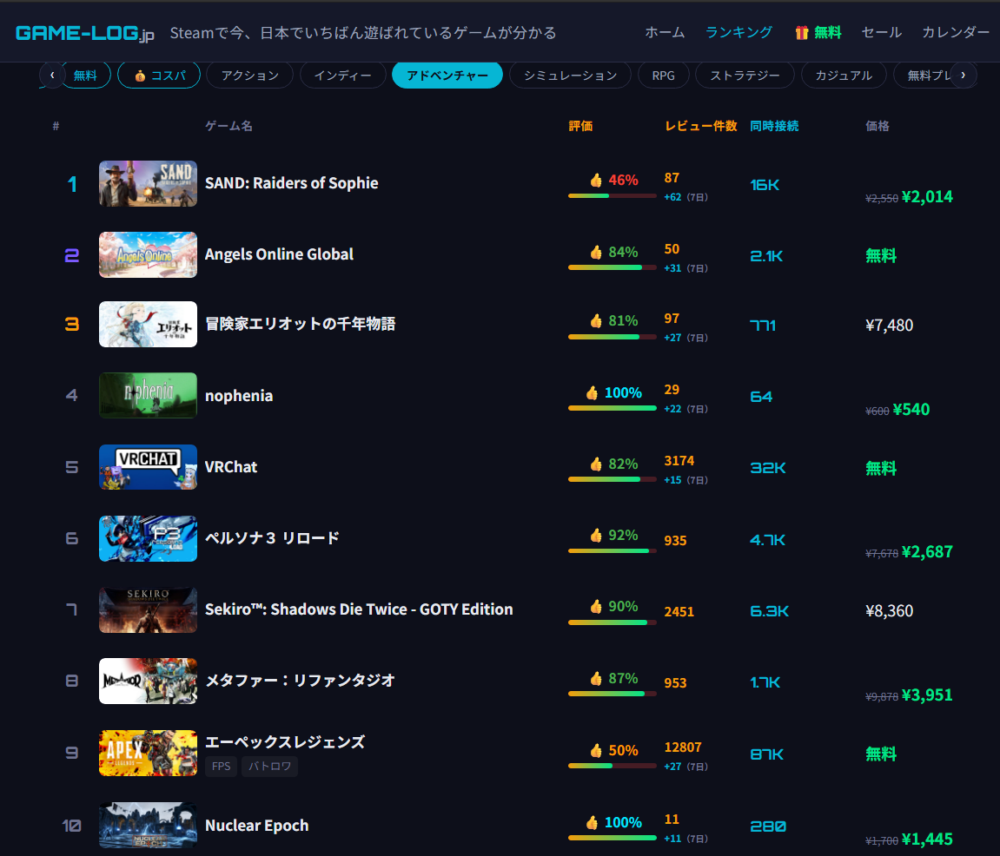

レビューデータは計4466、6番目に多いジャンルである。ストーリー形式のものが多い傾向にある。

### Simulation

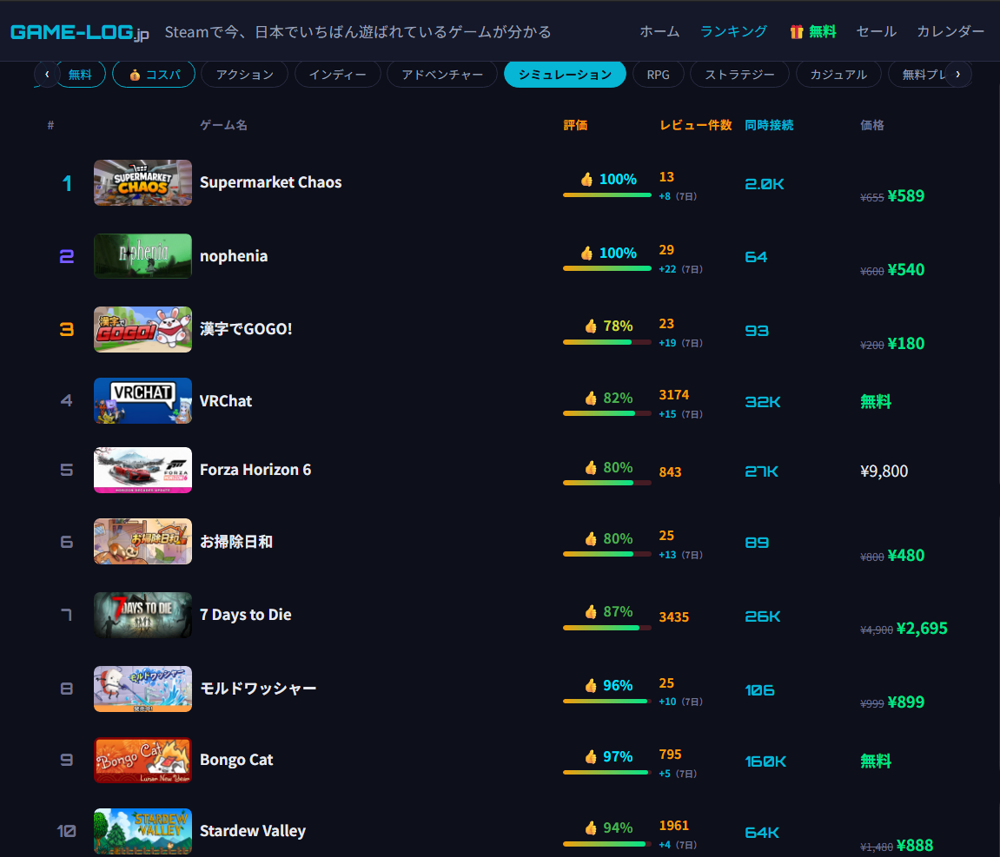

レビューデータは計5785、5番目に多いジャンルである。時間を忘れて没頭できるゲームが多い。

### RPG

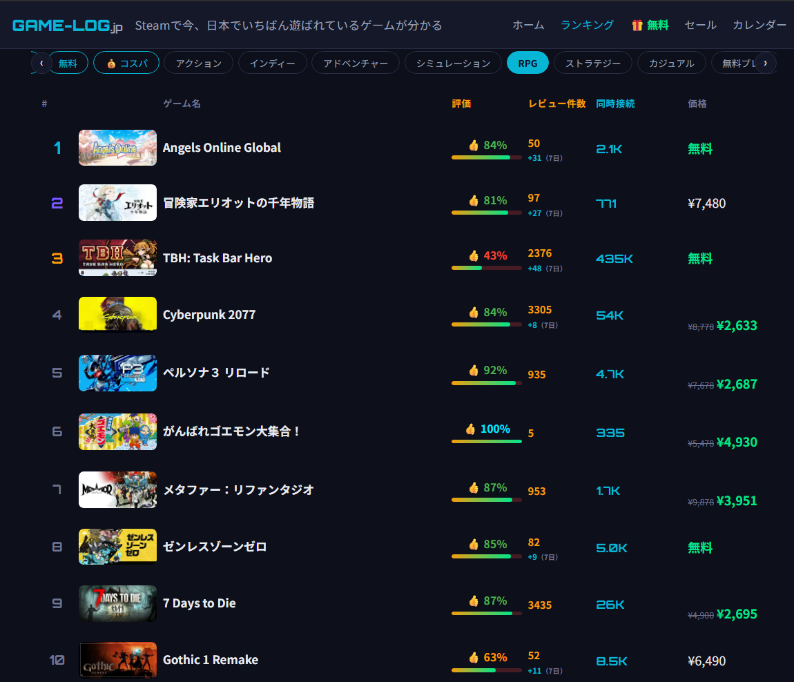

レビューデータは計8273、三番目に多いジャンルである。自由度の高さや没入感を売りにしているゲームが多い傾向にある。

### Strategy

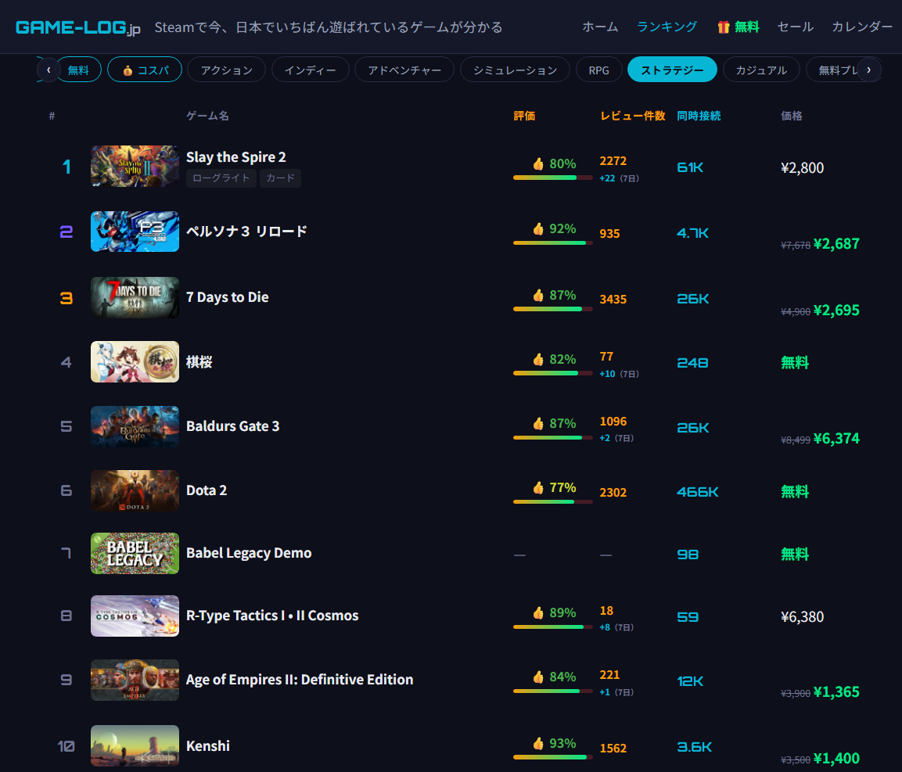

レビューデータは計9180、最も多いジャンルである。様々なジャンルとの統合が進んでおり、幅広い種類のゲームを遊ぶことが出来る。

### Casual

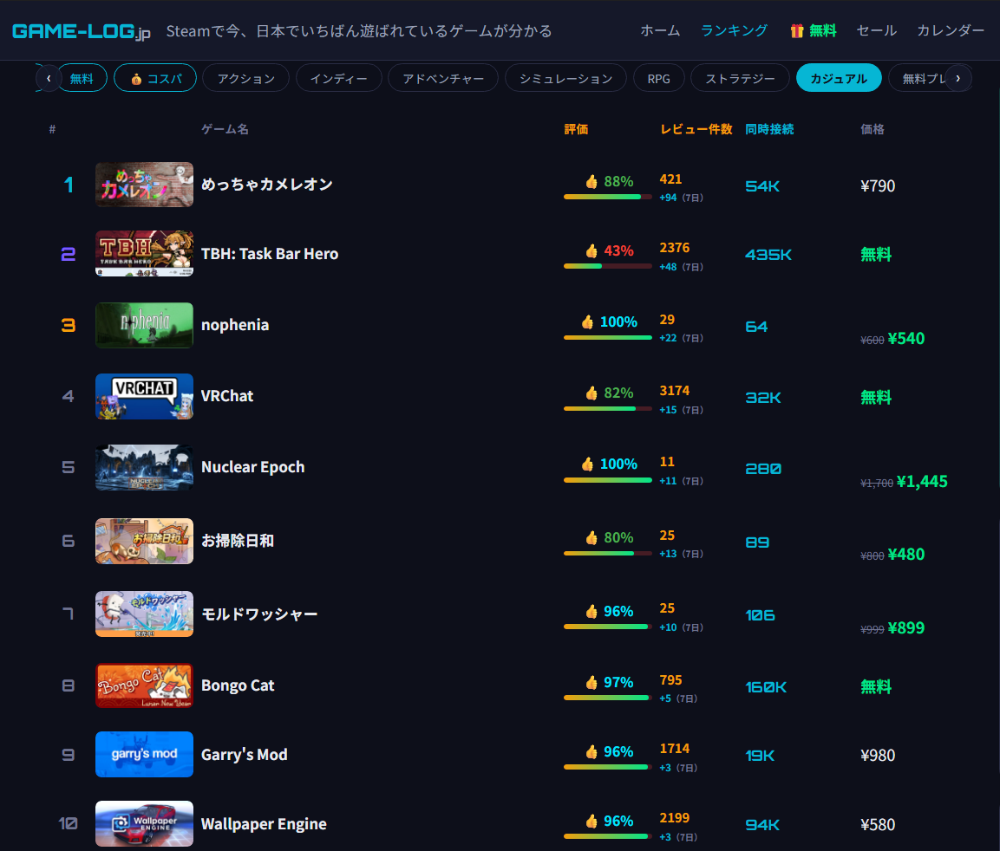

レビューデータは計4241、最も少ないジャンルとなった。ルールや操作が簡単で初心者でも遊びやすいのが特徴だ。

## まとめ

本研究では計7ジャンル・70作品から総計48377個の日本語レビューデータを用いて検証していく 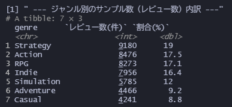

集計の結果、多いジャンルで約20％、少ないジャンルで9%程のデータとなったが、いずれのジャンルも数千件のデータで構成されており、検証するのに十分な量であると思われる。

次の章ではそれぞれのジャンルの特徴を実際のデータから算出していく。

# 要約統計量

ここからは変数から得られる基本的な特徴ををジャンルごとに整理していきたいと思う。 要約統計量としてデータを表すうえで重要となる二つの変数を分析していく。

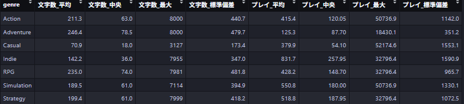

ここから読み取れる各ジャンルの特徴をまとめると、

- Action

  文字数の全ての値が高いことから、熱心なレビュアーが多そうだ。 一部の人はこの上なくハマっているが、一般人もそこそこ長い時間遊んでいる。**長期間遊んでいる人が多そうである。**

- Adventure

  最も熱量の高い層を持つ。しかし、それとは裏腹にプレイ時間は短い。これはストーリーを重視している**完結型ゲーム**が多いからだと推測できる。

- Casual

  最もレビューが少ないが、プレイ時間に大きなばらつきがみられる。この原因として、**壁紙ツール**などもこのジャンルに分類されることが考えられる。

- Indie

  特筆すべきは平均プレイ時間の多さだろう。**低価格な上、熱中しやすいゲーム**が数多くの人を魅了している可能性がある。

- RPG

  比較的熱心なレビュアーが多く、**Adventureと似たような性質を持つ**。実際、この二つのジャンルに跨っているゲームは数多くある。

- Simulation

  レビュアーの熱量は平均的だが、プレイ時間の値が軒並み高くまとまっており、購入したユーザーが**定着して長い期間遊んでいる**ことが伺える。

- Strategy

  全てにおいて**Simulationと似たような結果**となっており、こちらも安定率の高さが感じられる。プレイ時間の中央値が高いこともこの推論を裏付けている。

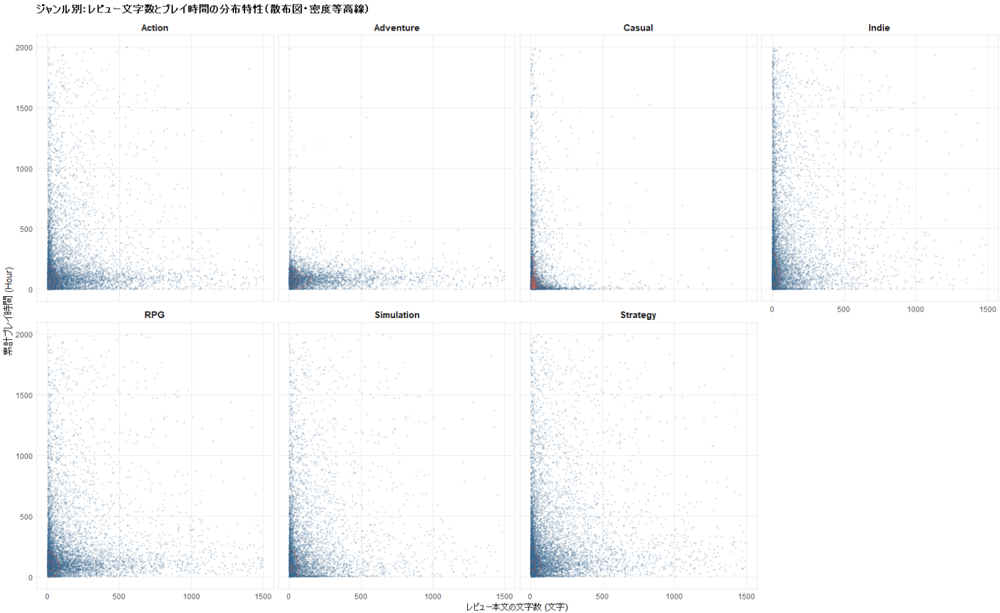 また、上の散布図のグラフは各ジャンルごとのレビュアーの散らばりを表している。この図からわかるように、どのジャンルもプレイ時間の最大は大きく平均から外れた外れ値を示している。一様に10000時間以上のため、これは外れ値として見てよさそうだ。

# 分析

ここからは様々な分析を通じてデータを多面的に解釈していこうと思う。

## ジャンルごとのユーザーの評価まとめ

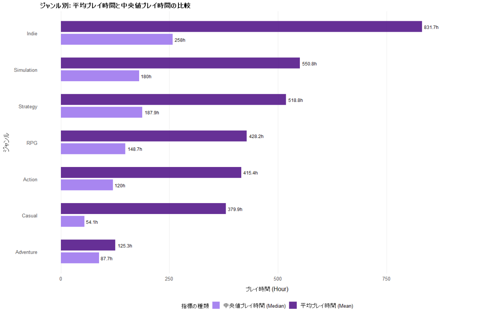

先ほどの情報をグラフで表すとこうなる。

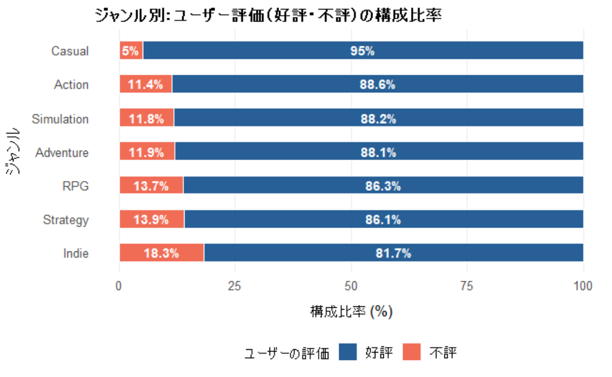

ジャンルごとの評価率を見てみると、Casualが不評率が圧倒的に少ないのが分かる。それはこのジャンルのゲームは操作が直感的にでき、PCのスペック関係なく動きやすく、大衆向けの極めて安定的なジャンルであることが伺える。

他ジャンルは１０％近くにいるため、市場の期待値がここら辺に存在していると思われるが、Indieのみ頭一つ抜けて不満率が多い。その理由として、Indieゲームにありがちなバグの多発が挙げられると思う。大手ゲームメーカーと違って大規模な開発環境が無いため、デバッグなどを行いづらく、最適化不足が起きやすいのだと思われる。また、このジャンルは尖っているゲームが多いので、肌に合わない人が離脱している可能性もある。後述する形態素解析ではIndie中心に解析していこうと思う。

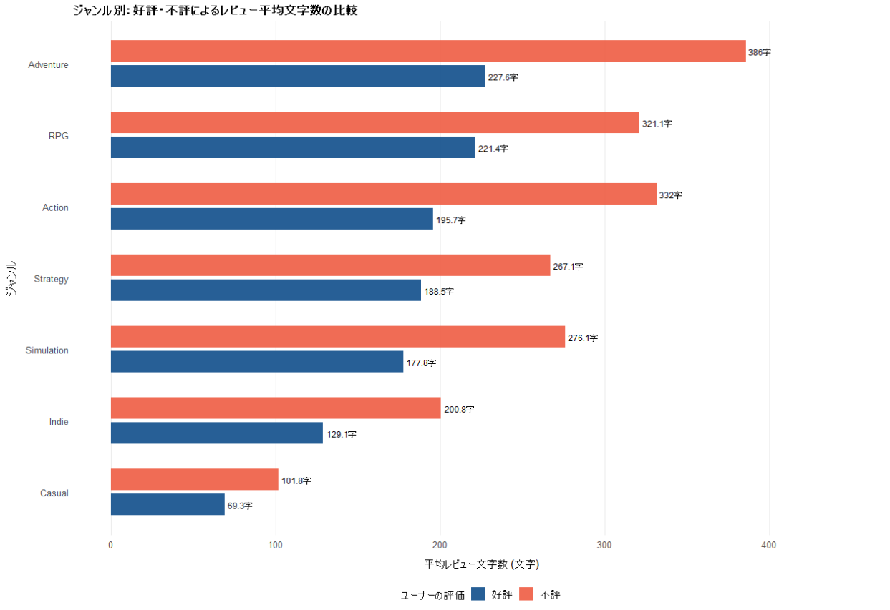

このグラフから、全ジャンル全てにおいて不評の方が好評よりレビュー文字数が圧倒的に長いことが分かる。ここでもCasualは文字数が少ないが、ActionとAdventureに至っては約1.5倍ほどの伸び幅を見せている。Actionでは対人戦をやりこんでいる人々からの不満、Adventureでは物語に対する不満があふれ出て、このような長文になっていることが伺える。先ほどの熱量の考察とも合致するので、非常に興味深い結果である。

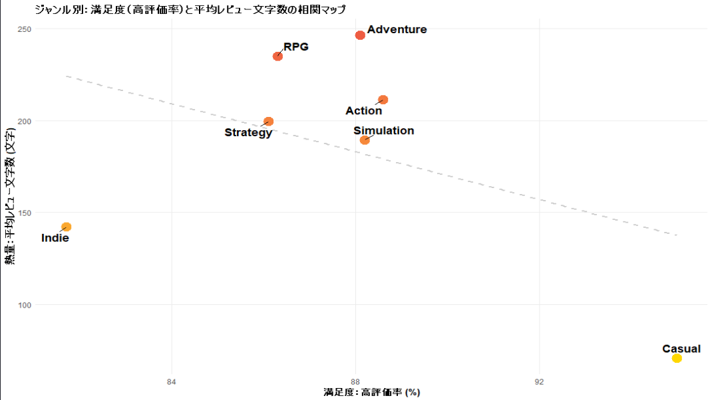

相関マップで表しても、右肩下がりになっており、この傾向が明らかであることが分かる。

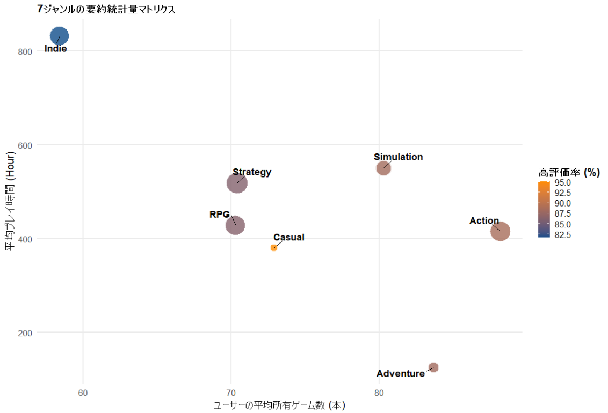

先ほどの情報をまとめたグラフである。

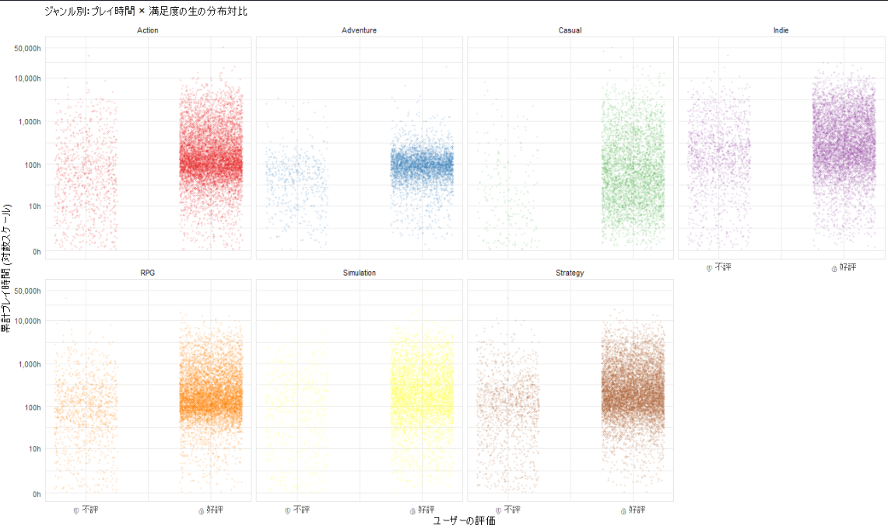

これはジャンル別のプレイ時間を評価別に散布図にしたものである。こう見ると、Casualの離脱層がいかに少ないか一目瞭然である。
また、Adventureに注目してみると、皆ある一定の時間にまとまっていることが見て取れる。これも、先ほど言ったようにAdventureが完結型ゲームであることの影響が大きそうだ。また、不評層もある程度遊んでからやめているのがデータからわかる。SimulationもAdventureと同じようなグラフになっているが、ばらつきが少し多いように見える。また、Indie・Strategy・RPGにおいては不評のタイミングが色濃く出ているのが特徴的だ。皆１００時間ほど遊んでやめているため、そこそこプレイしたが、ある仕様に耐え切れずに離脱するケースが多いのだと推察できる。

# 形態素解析(レビュー分析)

今回のレビュー分析では、前段階で特に特徴的だったIndieのみに絞って行おうと思う。
まず早期レビュー組、中期レビュー組、長期レビュー組に分け、それぞれのレビューにおける特徴的な単語を抽出したいと思う。

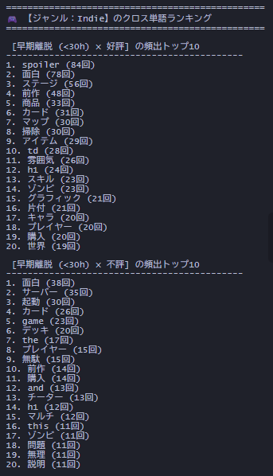

これはプレイ時間が30時間未満の層のレビューから抽出した特徴的な単語だ。好評の方では前作との繋がりや、ステージ・雰囲気・グラフィック・世界などの世界観をほめたたえるようなレビューがよくあるのが分かる。

一方、不評組からは、サーバー・起動などの言葉が上位に並んでおり、手薄な開発環境だからこそ起こる問題が浮き彫りになっている。ゲームを始める前段階の時点で躓いてしまっている人が多くいるように思える。また、説明という言葉からも大手ゲームに比べて、ゲーム内チュートリアルが不親切・不十分だったりする傾向がある。また、チーター・マルチといった単語からは対人ゲームから受けるストレスが決定的な離脱につながっている事が示唆されている。

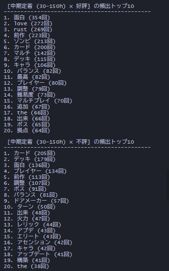

この層では30-150hとそこそこ遊んだ層のレビューを抽出している。
中程度のプレイ時間の層では、好評でバランス・難易度などのゲームバランスや調整のうまさを褒めるレビューが見受けられる。マルチプレイなどの単語からも、ゲームシステムに慣れ、そのゲームに不満があまりない人が多いように思える。

一方、不評のランキングからはアプデ・アップデートといった言葉が二個ランクインしているのを見るに、今まで良かったのがアプデによって改悪を受け、その結果ゲームから離れてしまうといった事態が起きているのかなと思った。先ほどの初期段階の不評にあったゲーム環境についての言及はなくなり、より本質的な単語が出てきている。レリック（遺物）やアセンション（高難易度モード）といった単語が出てきていることから、ある程度やりこんだ人がそのゲームの中上級者に課す課題が理不尽すぎてやめてしまうのではないかとも思った。

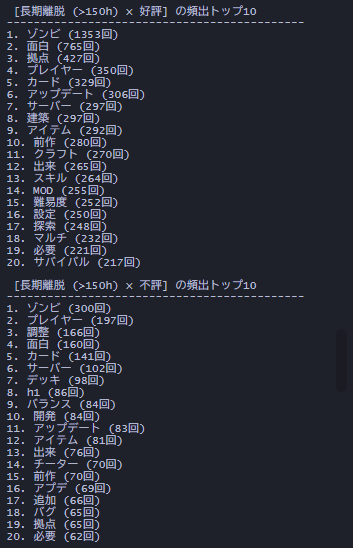

この層は150時間以上遊んだコアプレイヤーからの意見をまとめている。

不満レビューからはアプデ、追加、バランス、開発、調整などの単語が軒並みランクインしていることを考えても、アプデの仕様変更などで急にゲームが変わってしまい、裏切られたようになってしまっているのが感じ取れる。

## 仮説検証

仮説として立てた、初期の高評価と長期の低評価の頻出単語を確認して、本当に関連性があるのか確かめたいと思う。
この仮説は、初期のファーストインプレッションとしてそのゲームを好印象にした要素が、長期にわたって遊んでいく中で様々なアップデートによって変わってしまい、結果的に離脱してしまうのではないかと思って立てた。実際に比較してみると

ステージ、前作、カード、雰囲気、グラフィックなどの言葉が並んでいる。
一方長期離脱組では、

同じようにカード、アイテムなどそのゲームを象徴するような単語が一部見られた。あまりに抽象的すぎるためこれで断定は出来ないが、ある程度の関連性があるといっても良さそうである。

# その他のジャンルの形態素解析

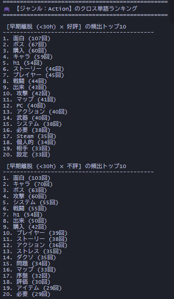
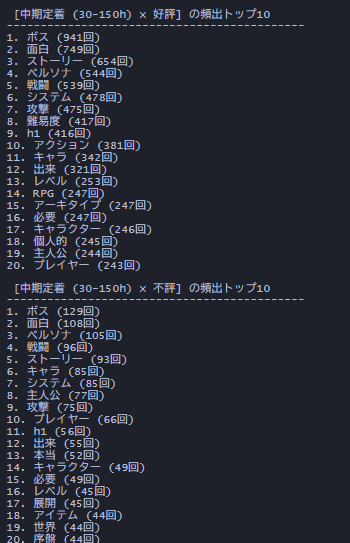
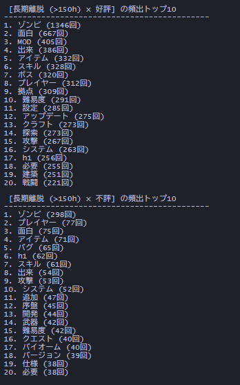

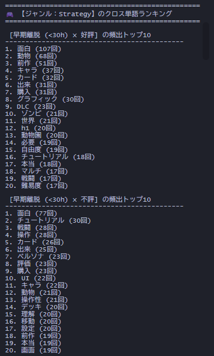
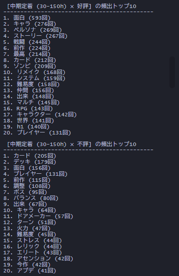
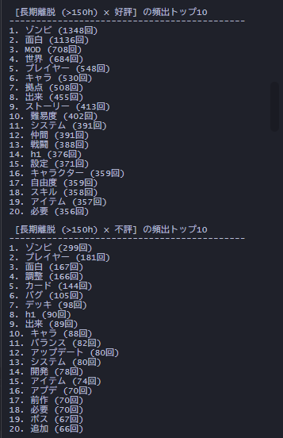
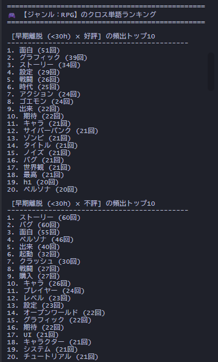
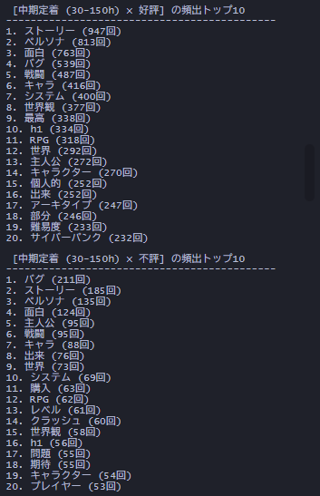
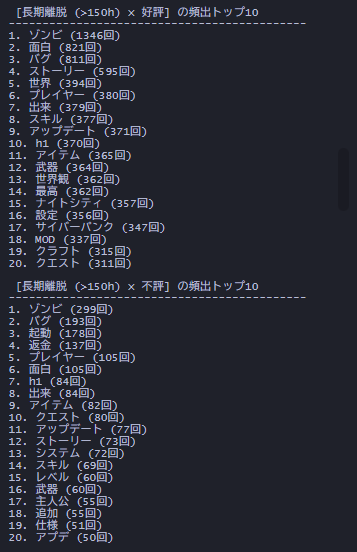
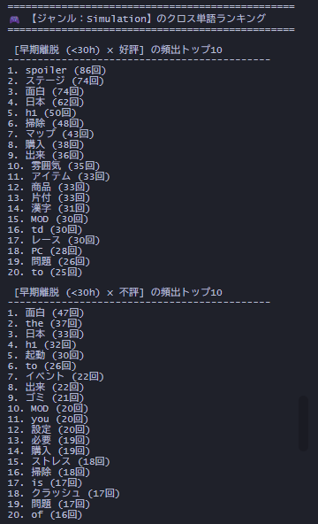
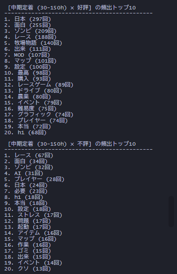
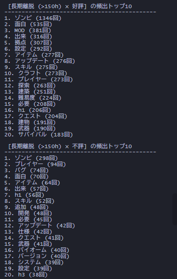
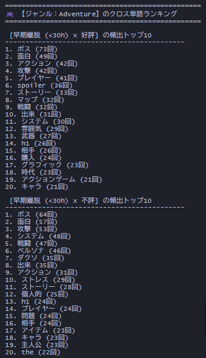
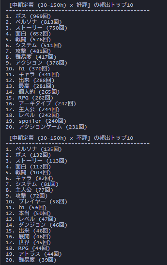
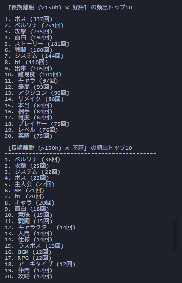
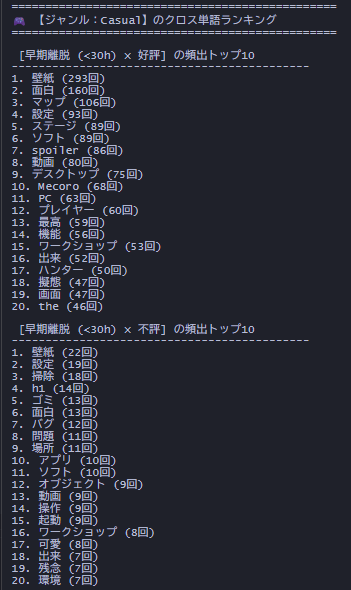
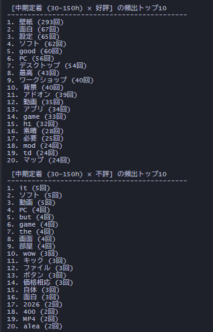
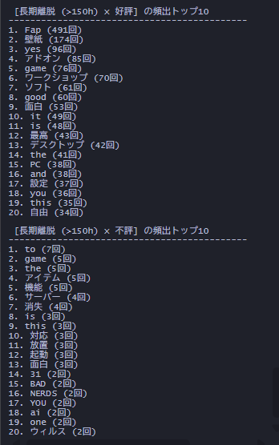

# 結論と反省・改善点

結果として、自分が立てた仮説はある程度立証されたので良かった。また、プレイ時間と離脱理由という数字と文字を組み合わせることでより多角的に分析できたのが良かったと思う。今回はIndieにしかレビュー分析をかけていないが、それぞれのユーザー層に応じてレビューに顕著な差が表れたので、RQは統計的に十分有意であると言える。

そして、この研究の副産物として、ジャンル別の傾向がはっきりしてきたので、様々な人に合うゲームを診断することも出来るようになった。

しかし、今回の研究の反省点として、ジャンルを跨いでゲームがかぶってしまう問題があった。
例えば7days to dieというゲームは5ジャンルにおいて登場している。

ランキングからゲームの除外をするのは恣意的な操作に当たるので今回はそのままにしたが、レビュー数も2000件以上だったのも相まって今回の研究に大きな影響を及ぼしていると思う。

また、APIから取得するときにSteam側の日本語フィルターが甘くなり、英語のレビューが日本語扱いで流れてくることがしばしばあった。今回はそのまま通してしまったが、同じようなことを防ぐために今後はフィルターをローカルにも用意した方がいいなと感じた。

# 参考ウェブサイト

Steamゲームランキング - 日本人に人気のゲーム　https://gamelog-jp.com/ranking/ Aikの技術日記 - SteamAPIについてまとめてみた　Part3 https://aik0aaat.hatenadiary.jp/entry/2020/10/11/002757
